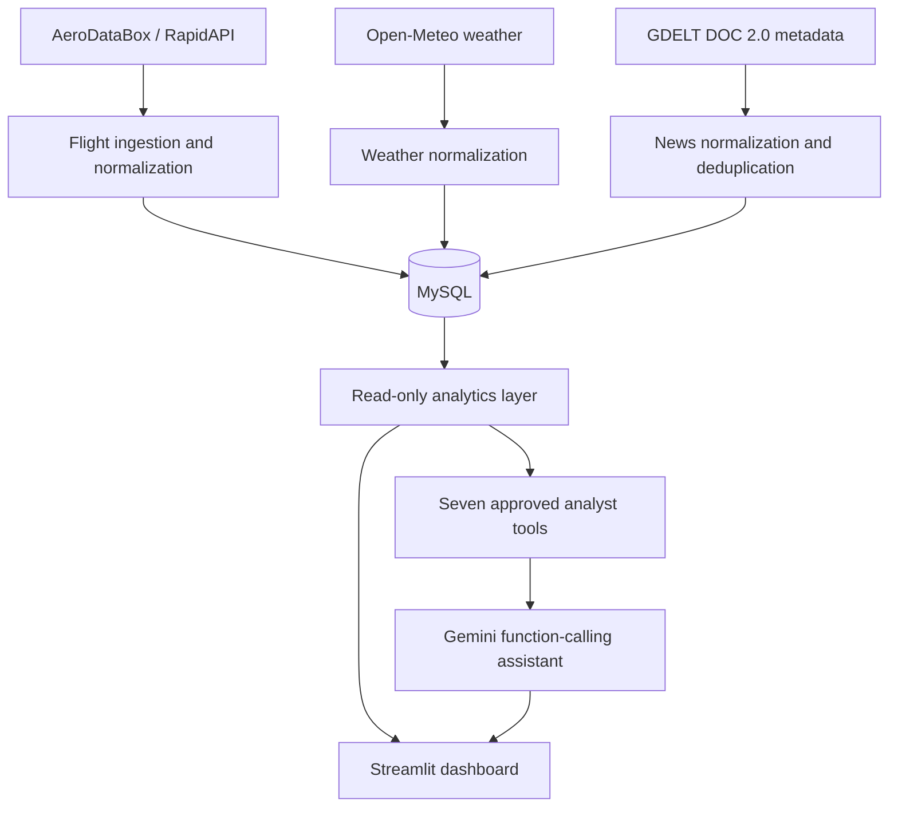

# Flight Pulse

Flight Pulse is a portfolio flight-analytics application for exploring Toronto
Pearson International Airport (YYZ) operations. It combines normalized flight
records, hourly weather, disruption-news metadata, SQL analytics, a Streamlit
dashboard, and a Gemini assistant that can call only approved read-only tools.

The project is designed around one practical question:

> What does the available evidence tell us about a flight delay?

Flight Pulse deliberately distinguishes observed facts from contextual
associations. Weather or news near a delayed flight may be a possible
contributor, but the application does not claim causation without explicit
supporting evidence.

## Project motivation

Flight information is useful on its own, but delay investigation usually
requires several kinds of context. Flight Pulse demonstrates an end-to-end data
workflow that:

- retrieves and normalizes external operational data;
- stores reproducible records in a relational database;
- answers repeatable analytical questions with readable SQL;
- adds weather and disruption-news context;
- presents findings in a recruiter-friendly dashboard; and
- constrains an LLM to a small set of grounded, read-only functions.

The emphasis is data engineering, analytics, responsible AI integration, and
clear communication—not prediction or unsupported root-cause claims.

## Current validated results

- 72 real YYZ flights retrieved from AeroDataBox and stored in MySQL
- 48 hourly YYZ weather observations stored
- 72 of 72 flights matched to weather by scheduled YYZ UTC hour
- reusable flight analytics implemented for status, airline, route, and time
- Streamlit dashboard implemented with eight portfolio sections
- seven read-only analyst tools implemented
- Gemini structured function-calling chat implemented
- 58 automated tests passing

These figures describe one short collection window and are not representative
of long-term YYZ, airline, or route performance.

## Architecture



In compact form:

```text
AeroDataBox
     ↓
ingestion / normalization
     ↓
   MySQL ← weather + news metadata
     ↓
 analytics
   ↙     ↘
dashboard  read-only analyst tools
   ↘     ↙
Streamlit + Gemini tool-calling assistant
```

Gemini never receives unrestricted SQL access. It can request only the seven
declared analyst functions; Flight Pulse validates the tool name and every
argument before executing parameterized, read-only database queries.

See [the architecture document](docs/ARCHITECTURE.md) for component boundaries,
data flow, and safety controls.

## Data flow

1. The AeroDataBox client builds a YYZ FIDS request and receives flight JSON.
2. Provider-specific parsing stays inside the ingestion layer.
3. Flights are normalized to a provider-independent model with UTC-aware
   timestamps and derived delays only when scheduled and actual times exist.
4. MySQL upserts records using deterministic provider identifiers.
5. Open-Meteo hourly weather is normalized to UTC and stored by airport/hour.
6. GDELT article metadata is normalized and deduplicated without storing full
   copyrighted article text.
7. The analytics layer runs fixed, readable SQL over the stored data.
8. Streamlit renders metrics, charts, tables, weather context, and data-quality
   warnings.
9. Gemini selects from approved function declarations, receives the local tool
   result, and produces a grounded response with explicit limitations.

## Major features

- AeroDataBox flight ingestion isolated from normalized domain models
- signed departure and arrival delay calculation
- duplicate-safe MySQL persistence
- flight-status, airline, route, time, and data-quality analytics
- YYZ hourly weather context
- disruption-news metadata ingestion and deterministic URL identity
- professional Streamlit dashboard
- conversational session history
- explicit Gemini tool whitelist and argument validation
- no model-generated SQL or arbitrary Python execution
- enforced small-sample and non-causality language
- mocked external-service tests that consume no provider quota

## Technologies

- Python 3.11
- MySQL
- Streamlit 1.64
- Google Gen AI SDK (`google-genai`)
- AeroDataBox through RapidAPI
- Open-Meteo
- GDELT DOC 2.0
- `urllib.request` for ingestion HTTP clients
- `mysql-connector-python`
- `python-dotenv`
- standard-library `unittest`

## Repository layout

```text
app.py                         Streamlit dashboard and chat UI
flight_pulse/analysis/         Reusable SQL analytics
flight_pulse/analyst/          Approved read-only analytical tools
flight_pulse/chat/             Gemini declarations, validation, and routing
flight_pulse/ingestion/        Provider-specific clients and normalization
flight_pulse/config.py         Environment-backed configuration
flight_pulse/models.py         Normalized data models
flight_pulse/pipeline.py       Small ingestion orchestration functions
flight_pulse/repository.py     Parameterized MySQL persistence
sql/schema.sql                 Local MySQL tables and indexes
tests/                         Mocked unit and integration-boundary tests
docs/                          Specification, plan, architecture, and status
```

## Run locally

### Prerequisites

- Conda
- Python 3.11
- MySQL 8-compatible server
- a Gemini Developer API key for the chat section
- AeroDataBox/RapidAPI credentials only if you separately run flight ingestion

### 1. Create the environment

```bash
conda create -n flight-pulse python=3.11
conda activate flight-pulse
python -m pip install -r requirements.txt
```

### 2. Configure environment variables

```bash
cp .env.example .env
```

Populate `.env` locally. Never commit it.

Required for the dashboard database connection:

- `MYSQL_HOST`
- `MYSQL_PORT`
- `MYSQL_DATABASE`
- `MYSQL_USER`
- `MYSQL_PASSWORD`

Required for AI chat:

- `GEMINI_API_KEY`

Optional configuration:

- `GEMINI_MODEL` defaults to `gemini-3.1-flash-lite`
- `AERODATABOX_API_HOST` defaults to `aerodatabox.p.rapidapi.com`

Required only for a separately authorized AeroDataBox ingestion run:

- `AERODATABOX_API_KEY`

Open-Meteo requires no key. The implemented GDELT DOC 2.0 request also requires
no key.

### 3. Create the MySQL database

Create an empty local database using an administrative MySQL account:

```bash
mysql -u root -p -e "CREATE DATABASE IF NOT EXISTS flight_pulse CHARACTER SET utf8mb4 COLLATE utf8mb4_unicode_ci;"
```

Create a dedicated local application user with only the privileges needed for
your development workflow, then apply the schema:

```bash
mysql -u <mysql-user> -p flight_pulse < sql/schema.sql
```

The schema creates:

- `flights`
- `weather_observations`
- `news_articles`

The SQL is idempotent and stores application timestamps as UTC `DATETIME`
values. For an analytics-only deployment, use a separate MySQL account with
`SELECT` permission only.

### 4. Populate data

The repository does not commit live provider responses or database contents.
The ingestion clients and orchestration functions live under
`flight_pulse/ingestion/` and `flight_pulse/pipeline.py`; running them requires
your own provider access and a deliberate quota decision.

The dashboard can start against an empty schema, but meaningful charts and
answers require stored flight and weather records.

### 5. Start Flight Pulse

```bash
streamlit run app.py
```

Streamlit prints the local URL, normally `http://localhost:8501`.

## Dashboard sections

- Overview
- Flight Status
- Airline Analysis
- Route Analysis
- Time Analysis
- Weather Context
- Data Quality and Limitations
- Ask Flight Pulse

## Sample analytical questions

- How many flights are in the current sample?
- How many flights are delayed or cancelled?
- Which airlines have delayed flights in this sample?
- Which routes contain delayed flights?
- At which scheduled YYZ hours were delays observed?
- Which stored flights have the largest observed delay values?
- How many records are missing actual departure or arrival timestamps?

## Sample AI questions

- How many flights were delayed?
- Show me cancelled flights.
- Tell me about AA 3606.
- What was the weather around AA 3606?
- Which routes had delays?
- Why was AA 3606 delayed?
- Which airline had the most delayed flights in this sample?

AI answers are constrained to the current database sample. When stored evidence
cannot establish a delay cause, the assistant must say:

> Insufficient evidence to determine the delay cause.

## Testing

External clients use fixtures or injected mocks in automated tests. Tests do not
consume AeroDataBox, Open-Meteo, GDELT, or Gemini quota.

Run the complete suite:

```bash
python -m unittest discover -s tests -v
```

Current result: **58 tests passing**.

## Screenshots

The following portfolio images should be captured manually after starting the
dashboard with the validated local dataset:

1. **Overview and status** — metrics plus status distribution.
2. **Airline and route analysis** — charts and the sample-size disclaimer.
3. **Weather context** — conditions and the non-causality caption.
4. **AI chat** — a grounded flight lookup or delay investigation showing the
   exact insufficient-evidence wording.

Suggested future paths:

```text
docs/screenshots/01-overview.png
docs/screenshots/02-airline-route.png
docs/screenshots/03-weather-context.png
docs/screenshots/04-ai-chat.png
```

After capturing them, add the images to this section with short captions. Do not
include API keys, database credentials, browser extensions, or unrelated desktop
content in screenshots.

## Known limitations

- The flight dataset contains only 72 records from one short YYZ window.
- Actual departure exists for only 3 flights and actual arrival for only 2.
- One 1,060-minute departure-delay value materially skews averages.
- Weather is matched by scheduled YYZ UTC hour; association does not prove
  causation.
- Open-Meteo data used here is forecast/model data rather than direct METAR
  observations.
- The GDELT live validation request returned HTTP 429, so live article ingestion
  remains unverified and the current news table is empty.
- The Gemini live validation request returned HTTP 503 before tool selection.
- Live GDELT and Gemini validation may require a future, separately approved
  retry.
- Gemini free-tier prompts and tool results may be used by Google to improve its
  products.
- No sanitized seed dataset or one-command ingestion CLI is included.
- Results must not be generalized to broader airline, route, airport, or
  historical performance.

## Future improvements

- collect a longer, repeatable flight history within provider licensing limits;
- add a sanitized demo dataset for zero-credential portfolio review;
- improve actual-time completeness and outlier investigation;
- validate GDELT and Gemini again when separately authorized;
- evaluate observed METAR weather as an alternative context source;
- add accessibility and browser-based visual QA;
- introduce deployment only after provider, privacy, and billing review.

## Project documentation

- [Product specification](docs/SPEC.md)
- [Implementation plan](docs/PLAN.md)
- [Architecture](docs/ARCHITECTURE.md)
- [Data-source decision](docs/DATA_SOURCES.md)
- [Current status](docs/STATUS.md)
