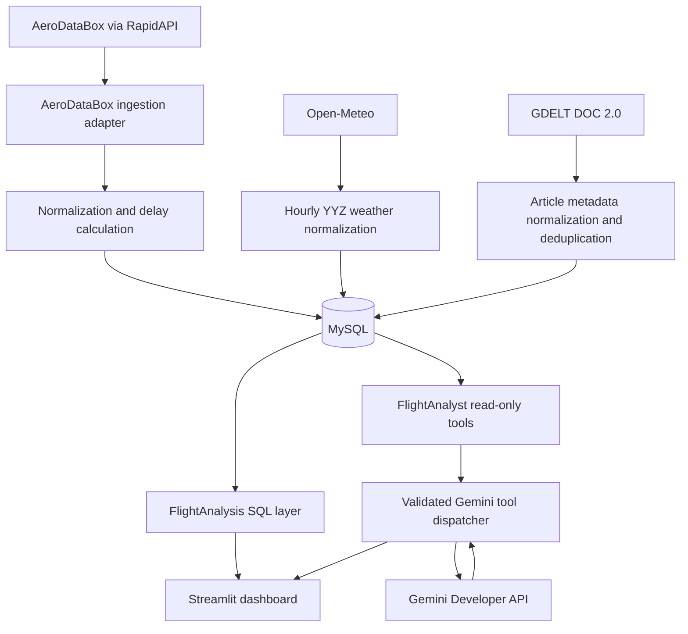
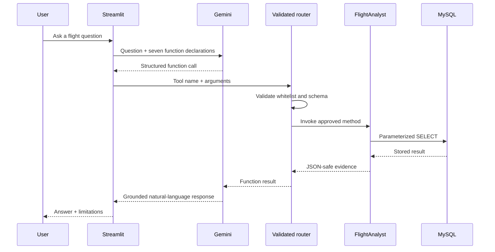

# Flight Pulse — Architecture

## Status

Implemented MVP architecture as of 2026-10-02.

Flight Pulse is a local-first flight analytics and investigation application for
Toronto Pearson International Airport (YYZ). It combines flight operations,
hourly weather, disruption-news metadata, SQL analytics, a Streamlit dashboard,
and a constrained Gemini assistant.

The central analytical question is:

> What does the available evidence tell us about this flight delay?

The system reports facts and contextual associations. It does not infer a
confirmed cause from weather or news proximity alone.

## System overview



The primary flow can be read as:

```text
AeroDataBox
     ↓
ingestion / normalization
     ↓
   MySQL ← weather + news metadata
     ↓
 analytics
   ↙     ↘
weather   news context
     ↓
Streamlit dashboard
     ↓
Gemini tool-calling assistant
```

Weather and news are ingested into MySQL before analysis. The second diagram
shows their analytical role as context alongside flight metrics.

## Component boundaries

### Flight ingestion

`flight_pulse/ingestion/aerodatabox.py` owns AeroDataBox-specific request and
JSON behavior. External fields are converted into `NormalizedFlight` objects
before persistence.

Delay values are derived only when both scheduled and actual timestamps exist:

```text
delay minutes = actual UTC timestamp - scheduled UTC timestamp
```

Missing actual times remain null. The ingestion layer does not fabricate delay
values from estimated or unconfirmed timestamps.

### Weather ingestion

`flight_pulse/ingestion/open_meteo.py` retrieves hourly data for YYZ coordinates
and normalizes timestamps to UTC. Weather is stored independently of flights.
Analysis matches a flight to the scheduled YYZ departure or arrival hour.

This is a temporal association, not a causal conclusion.

### News ingestion

`flight_pulse/ingestion/gdelt.py` retrieves GDELT article-list metadata for YYZ
operational-disruption concepts. It stores title, domain, URL, publication time,
language, topic, and fetch time—not full article text.

Canonical URLs produce deterministic SHA-256 identifiers for duplicate-safe
persistence. Article proximity is supporting context only.

### Persistence

`flight_pulse/repository.py` uses `mysql-connector-python` with parameterized
statements. The schema contains:

- `flights`, keyed by deterministic provider flight ID;
- `weather_observations`, keyed by airport and observation time; and
- `news_articles`, keyed by deterministic article ID.

All application timestamps are converted to UTC before storage in MySQL
`DATETIME` columns.

### Analytics

`flight_pulse/analysis/` contains fixed, readable SQL for:

- overview and status metrics;
- delayed and cancelled flights;
- airline and route summaries;
- scheduled YYZ hour analysis;
- top observed delays;
- weather context; and
- missingness, duplicate, and extreme-value checks.

Business logic stays outside Streamlit so the dashboard and AI tools share the
same definitions.

### Dashboard

`app.py` loads one cached MySQL analytics snapshot and renders eight sections:

1. Overview
2. Flight Status
3. Airline Analysis
4. Route Analysis
5. Time Analysis
6. Weather Context
7. Data Quality and Limitations
8. Ask Flight Pulse

The dashboard makes no external ingestion calls. Gemini is contacted only when
a user submits a chat question.

### Read-only analyst tools

`flight_pulse/analyst/` exposes exactly seven structured functions:

- `get_flight_overview`
- `find_flight`
- `get_airline_analysis`
- `get_route_analysis`
- `get_weather_context`
- `get_news_context`
- `investigate_delay`

The tools execute fixed parameterized queries. There is no generic SQL tool and
no method that accepts model-generated SQL.

### Gemini chat

`flight_pulse/chat/gemini.py` declares the seven functions to Gemini. The SDK's
automatic function execution is disabled. Flight Pulse handles each requested
call through a small explicit dispatcher that:

1. checks the tool name against a fixed whitelist;
2. rejects missing or unexpected arguments;
3. validates argument types;
4. calls the corresponding `FlightAnalyst` method;
5. returns the structured result to Gemini; and
6. bounds the conversation to four tool rounds.

Unknown tools such as `query_sql`, arbitrary Python, and destructive database
operations cannot be dispatched.

## Chat request sequence



## Safety and trust boundaries

- Secrets are loaded from `.env`, which is ignored by Git.
- `.env.example` contains variable names and non-secret defaults only.
- Provider-specific responses are normalized before database writes.
- Automated tests use fixtures and mocks, not live provider quota.
- Gemini receives only tool declarations, user chat context, and the result
  needed for the selected tool.
- The model cannot issue SQL or execute Python.
- Delay investigations preserve the exact fallback statement:
  `Insufficient evidence to determine the delay cause.`
- All reported performance is labeled as belonging to the current small sample.

## Failure behavior

- Missing required configuration produces a controlled dashboard message.
- Database cursors and connections close in `finally` blocks.
- Missing flight, weather, or news data remains explicit in tool results.
- External client tests inject HTTP openers and do not use the network.
- Gemini tool calls are bounded and invalid calls return safe errors.
- The live Gemini validation received HTTP 503 before tool selection and was not
  retried automatically.

## Current scope

The MVP is intentionally limited to YYZ and a small stored sample. It does not
include prediction, unrestricted natural-language SQL, automatic deployment, or
continuous provider polling.
